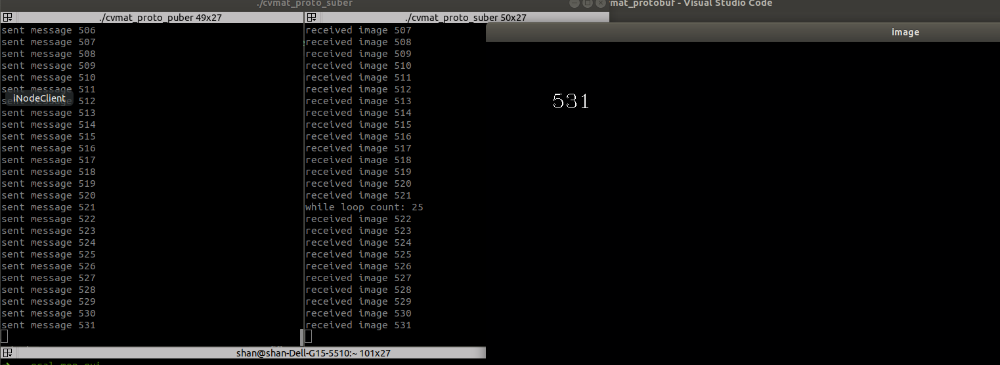
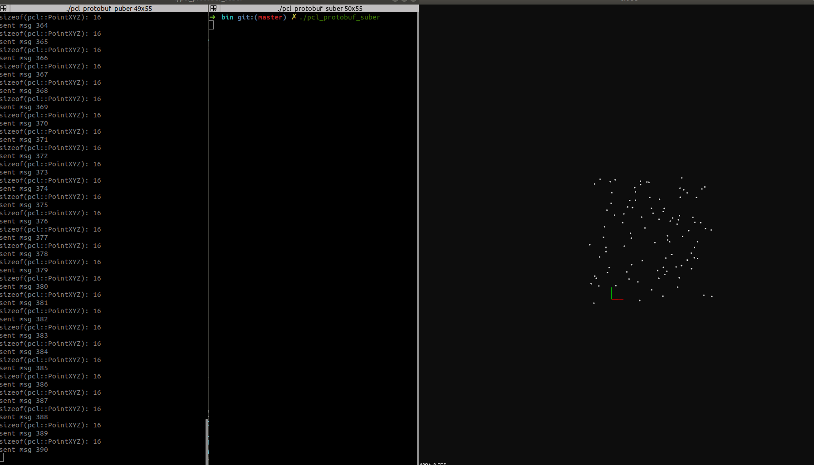

# eCAL 学习笔记

## 资源

-   [Homepage](https://eclipse-ecal.github.io/ecal/)
-   [Github](https://github.com/eclipse-ecal/ecal)


## 介绍

-   eCAL (**e**nhanced **C**ommunication **A**bstraction **L**ayer) 

-   由 Continental 开源的消息中间件，目前由 Eclipse 管理

-   数据传输方式

    -   本地通信: 共享内存
    -   网络通信: UDP / TCP (大数据量)

-   通信方式

    -   Topic: publish-subscribe
    -   Service: server-client

-   相比 ROS 没有中间代理商，无需master节点

    -   Message Broker
        -   所有消息的发送/接收都要经过broker，所以broker会成为整个系统的瓶颈点，影响整个系统的数据传输的延时和吞吐量。
        -   

    -   Message Brokerless
        -   点对点直接连接，该网络架构适合于低延时/高并发的场景。
        -   

-   支持多种数据序列化方法

    -   google protobuf, CapnProto, Flatbuffer, ...

    -   **序列化：**把对象转化为可传输的字节序列过程称为序列化。

        **反序列化：**把字节序列还原为对象的过程称为反序列化。

    -   最终的目的是为了对象可以**跨平台存储，和进行网络传输**


## Protobuf vs JSON

| 特性 \ 类型  | json         | protobuf         |
| ------------ | ------------ | ---------------- |
| 数据结构支持 | 简单结构     | 复杂结构         |
| 灵活程度     | 灵活使用     | 通过消息文件约束 |
| 数据保存方式 | 文本         | 二进制           |
| 数据保存大小 | 大           | 小               |
| 编解码效率   | 慢           | 快               |
| 语言支持程度 | 覆盖主流语言 | 覆盖主流语言     |


## 安装

-   目前根据 aiforce::core 的 ECAL 5.9.5 版本进行安装
    -   Ubuntu 18.04 x86_64 与 ARM64
        -   ECAL 5.9.5
        -   Protobuf 3.0.2
    -   Ubuntu 20.04 x86_64
        -   ECAL 5.9.5
        -   Protobuf 3.6.1


-   Install Protobuf 

    ```bash
    # install protobuf dependencies
    sudo apt-get install autoconf automake libtool curl make g++ unzip
    
    # download protobuf 3.0.2 source code from github
    # download gmock using autogen.sh, this step needs proxy, otherwise the zip file will be uncomplete
    ./autogen.sh
    # build
    #./configure --prefix=/usr # for custom path
    ./configure # /usr/local
    make -j8
    make check # no need
    sudo make install
    sudo ldconfig
    ```
    
    
    
-   Install ecal

    ```bash
    # install 5.11
    sudo add-apt-repository ppa:ecal/ecal-5.9
    sudo apt-get update
    sudo apt-get install ecal
    ```


## 官方例程

-   Topic 传输

    -   ecal_sample_person_snd/rec

        ```bash
        # 发送节点: 发送person信息
        ecal_sample_person_snd
        
        # 接受节点: 接受person信息
        ecal_sample_person_rec
        ```

    -   同一发布节点开启多次, 会在同一topic下发布不同节点的内容
    -   同一接受节点开启多次, 也会接受同一topic下不同内容


-   Service 传输

    -   ecal_sample_math_server/client

        ```bash
        # server: 负责接受数学计算的请求和提供数学计算
        ecal_sample_math_server
        
        # client: 负责发出数学计算的请求和接受结果
        ecal_sample_math_client
        ```

    -   同一server节点开启多次, 都会接受到对应service topic的请求

    -   同一client开启多次, 也会与同一名字的server连接


## Applications

-   eCAL Monitor

    -   显示节点，消息，进程，服务等信息

        -   bug：不同service 相同method名称，只能显示一个

        ```bash
        # start ecal monitor
        ecal_mon_gui
        ```

        

-   eCAL Recorder

    -   数据通过HDF5格式进行记录

    -   ```bash
        # start eCAL Recorder
        ecal_rec_gui
        ```

        

-   eCAL Player

    -   回放录制的数据

    -   ```bash
        # start eCAL player
        ecal_play_gui
        
        # 配合 ecal_mon_gui 查看数据
        ```

        

-   eCAL Sys

    -   开启、关闭、监控节点

    -   ```bash
        # start ecal_sys_gui
        ecal_sys_gui
        
        # 可以一次性开启多个节点
        # 可以保存配置文件，类似ROS的launch文件
        ```
        
        

## Demos - C++


### Demo00_protobuf_cmake_example

简单的Protobuf消息编译例子。


### Demo01_ecal_helloworld

-   本例程演示了如何通过ecal实现简单的pub/sub功能


### Demo02_ecal_helloworld_protobuf

-   本例程演示了如何通过ecal传输protobuf消息
    -   这个demo同时测试了5.9.5版本的ECAL subscriber callback 是单线程的，在callback中的耗时操作会影响主线程或其他callback。


### Demo03_minimal_service

-   本例程演示了如何通过ecal构建简单的service功能
    -   server 特性
        -   同一个节点可以有多个server
        -   同一个server可以有多个method
        -   同一个server同一时间只能被调用一次，后续的调用在当前调用未完成时会被阻塞
        -   不同server同一时间可以被同时调用

    -   client 特性
        -   Call
            -   直接调用，会阻塞后续操作，直到当前调用完成

        -   CallAsync
            -   异步调用，需要绑定callback，单次调用不会阻塞，多次调用仍然需要等待前一次调用结束


### Demo04_math_service

-   本例程演示了如何通过 protobuf 的 RPC 机制实现 ECAL service


### Demo05_ping_service

-   本例程演示了如何通过 protobuf 的 RPC 机制实现 ECAL service


​        

### Demo06_ecal_binary

-   本例程演示了如何通过 eCAL 发布 binary 数据


### Demo07_ecal_camera_examples

-   该demo包括了一个USB相机数据发布程序和一个 ecal_mon_gui 插件, 用以显示相机图像

-   原始项目地址: [ecal-caemra-samples](https://github.com/eclipse-ecal/ecal-camera-samples)

    -   ecal_camera_snd
        -   主要是通过QT相关组件获取图像数据并转换为protobuf数据
    -   camera_receiver_mon_plugin
        -   ecal_mon_gui 插件, 通过qt插件显示订阅的图像

-   安装方法

    ```bash
    # install dependencies
    sudo apt install ecal \
    qtmultimedia5-dev \
    libqt5multimedia5-plugins \
    qtwayland5 \
    protobuf-compiler \
    libprotoc-dev \
    libhdf5-dev \
    cmake
    
    # build&install
    mkdir build
    cd build
    # prefix install path set to /usr due to ecal install path is /usr
    cmake .. -DCMAKE_BUILD_TYPE=Release -DCMAKE_INSTALL_PREFIX=/usr
    make -j8
    sudo make install
    ```

-   使用方法

    ```bash
    # 启动相机数据发布程序
    # ecal_camera_snd [topicName] [cameraName] [OPTIONAL_resolutionWidth] [OPTIONAL_resolutionHeight] [OPTIONAL_maxFps]
    ecal_camera_snd usbcam /dev/video0 1280 720 30
    
    # 启动 ecal_mon_gui, 点击 topic 即可显示图像
    ecal_mon_gui
    
    ```

    


### Demo08_ecal_cvmat_protobuf

-   本例程演示了通过 ecal 和 protobuf 序列化传输 `cv::Mat` 数据
    -   cvmat_proto_puber.cpp
    -   cvmat_proto_suber.cpp
-   传输效果如下:


### Demo09_ecal_pcl_pointcloud_protobuf

-   本例程演示了通过 ecal 和 protobuf 序列化传输 `pcl::PointCloud<pcl::PointXYZ>` 数据
    -   pcl_protobuf_puber.cpp
    -   pcl_protobuf_suber.cpp

-   传输效果如下, 点云会沿X轴左右移动

    

