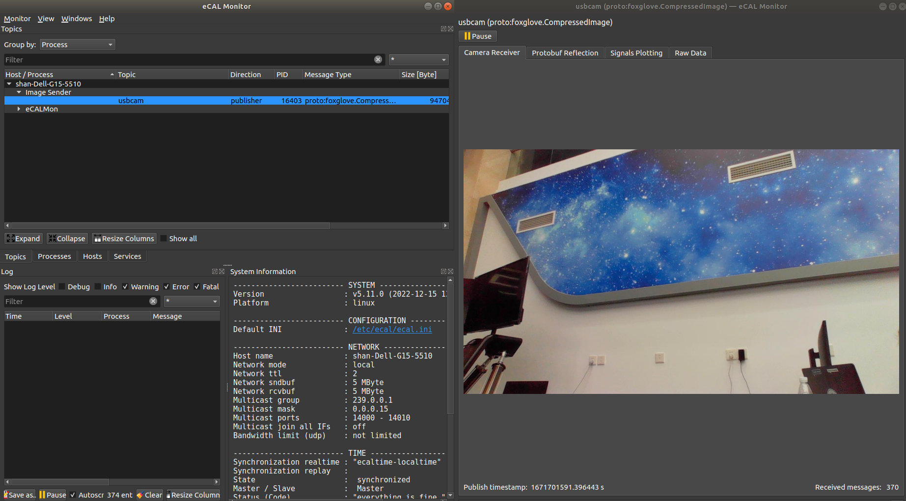

# eCAL Learning Note

## Introduction

-   eCAL (**e**nhanced **C**ommunication **A**bstraction **L**ayer) 

-   publish-subscribe middleware

    -   inter-process: **Shared memory**
    -   inter-host: **UDP/TCP**

    

## Resources

-   [Homepage](https://eclipse-ecal.github.io/ecal/)
-   [Github](https://github.com/eclipse-ecal/ecal)


## Install

-   Install Protobuf 

    ```bash
    # install protobuf dependencies
    sudo apt-get install autoconf automake libtool curl make g++ unzip
    
    # download protobuf 3.0.x from github
    # download gmock using autogen.sh, this step needs proxy, otherwise the zip file will be uncomplete
    ./autogen.sh
    # build
    #./configure --prefix=/usr # for custom path
    ./configure # /usr/local
    make
    make check # no need
    sudo make install
    sudo ldconfig
    ```
    
    
    
-   Install on Ubuntu

    ```bash
    # install latest version
    sudo add-apt-repository ppa:ecal/ecal-latest
    sudo apt-get update
    sudo apt-get install ecal
    
    # install 5.11
    sudo add-apt-repository ppa:ecal/ecal-5.11
    sudo apt-get update
    sudo apt-get install ecal
    ```


## Samples

-   Topic 传输

    -   ecal_sample_person_snd/rec

        ```bash
        # 发送节点: 发送person信息
        ecal_sample_person_snd
        
        # 接受节点: 接受person信息
        ecal_sample_person_rec
        ```

    -   同一发布节点开启多次, 会在同一topic下发布不同节点的内容
    -   同一接受节点开启多次, 也会接受同一topic下不同内容


-   Service 传输

    -   ecal_sample_math_server/client

        ```bash
        # server: 负责接受数学计算的请求和提供数学计算
        ecal_sample_math_server
        
        # client: 负责发出数学计算的请求和接受结果
        ecal_sample_math_client
        ```

    -   同一server节点开启多次, 都会接受到对应service topic的请求

    -   同一client开启多次, 也会与同一名字的server连接


## Applications

-   eCAL Monitor

    -   show topics, msgs, processes, hosts, services, log, system infos, configs ...

        ```bash
        # start ecal monitor
        ecal_mon_gui
        ```

        

-   eCAL Recorder

    -   record data through eCAL network

        -   centralized recording
            -   record all topics on main machine
        -   distributed recording
            -   each machine  record its own topics

    -   save data as HDF5 format

    -   ```bash
        # start eCAL Recorder
        ecal_rec_gui
        ```

        

-   eCAL Player

    -   play recorded data

    -   ```bash
        # start eCAL player
        ecal_play_gui
        
        # 配合 ecal_mon_gui 查看数据
        ```

        

-   eCAL Sys

    -   an application for starting, stopping and monitoring applications on one or multiple machines.

    -   ```bash
        # start ecal_sys_gui
        
        ```

        

## Demos - C++

### Dependencies

-   ```bash
    sudo apt install cmake g++ libprotobuf-dev protobuf-compiler
    ```


### Demo00_protobuf_cmake_example

simple protobuf cmake example


### Demo01_ecal_helloworld

-   topic puber/suber example

    -   helloworld_puber.cpp

    -   helloworld_suber.cpp

-   单节点多suber模式

    -   各个callback互不影响, 一个callback延时不影响另一个callback

    -   callback 只能即时处理一个数据

    -   主while循环中的延时不影响suber callback的执行


### Demo02_ecal_helloworld_protobuf

-   topic puber/suber with custom protobuf msgs example:

    -   helloworld_proto_puber.cpp
    -   helloworld_proto_suber.cpp

-   需要定义protobuf msg, 并在cmakelist中编译链接

    

### Demo03_minimal_service

-   minimal_service: 最简单的 ecal service 模板
    -   minimal_server.cpp
    -   minimal_client.cpp

-   service 特性

    -   service最长等待时间可以无限长

    -   blocking 和 callback 两种模式
        -   service client response callback 中的延时会影响外部的运行


### Demo04_math_service

-   math_service: 通过 protobuf 自定义 service request response  

    -   math_server.cpp

    -   math_client.cpp

        

### Demo05_ping_service

-   ping_service: 简单的 protobuf 自定义 service

    -   ping_service.cpp

    -   ping_client.cpp

        

### Demo06_ecal_binary

-   通过 eCAL 发布 binary 数据
    -   ecal_binary_snd.cpp
    -   ecal_binary_rec.cpp


### Demo07_ecal_camera_examples

-   原始项目地址: [ecal-caemra-samples](https://github.com/eclipse-ecal/ecal-camera-samples)

-   该demo包括了一个USB相机数据发布程序和一个 ecal_mon_gui 插件, 用以显示相机图像

    -   ecal_camera_snd
        -   主要是通过QT相关组件获取图像数据并转换为protobuf数据
    -   camera_receiver_mon_plugin
        -   ecal_mon_gui 插件, 显示订阅的图像数据

-   安装方法

    ```bash
    # install dependencies
    sudo apt install ecal \
    qtmultimedia5-dev \
    libqt5multimedia5-plugins \
    qtwayland5 \
    protobuf-compiler \
    libprotoc-dev \
    libhdf5-dev \
    cmake
    
    # build&install
    mkdir build
    cd build
    # prefix install path set to /usr due to ecal install path is /usr
    cmake .. -DCMAKE_BUILD_TYPE=Release -DCMAKE_INSTALL_PREFIX=/usr
    make -j8
    sudo make install
    ```

-   使用方法

    ```bash
    # 启动相机数据发布程序
    # ecal_camera_snd [topicName] [cameraName] [OPTIONAL_resolutionWidth] [OPTIONAL_resolutionHeight] [OPTIONAL_maxFps]
    ecal_camera_snd usbcam /dev/video0 1280 720 30
    
    # 启动 ecal_mon_gui, 点击 topic 即可显示图像
    ecal_mon_gui
    
    ```

    
